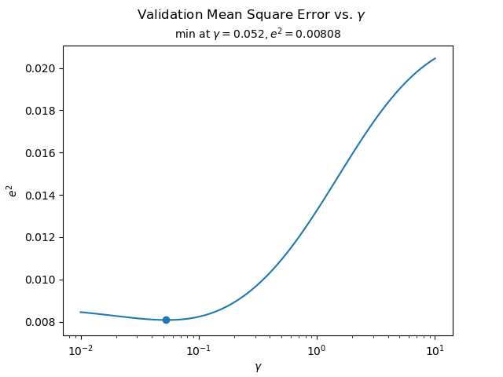
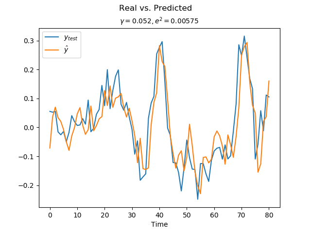
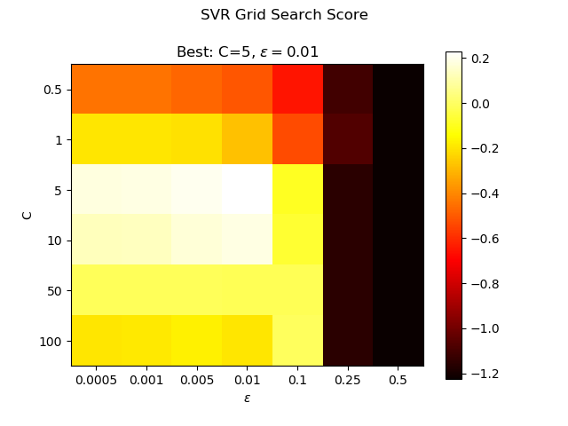
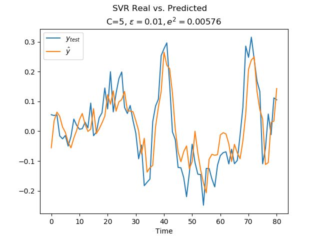
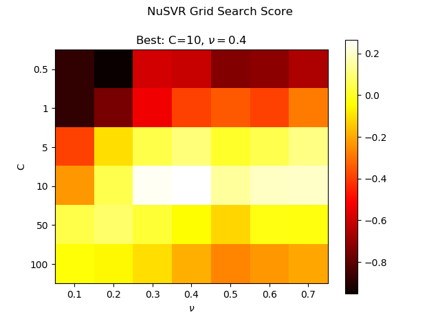
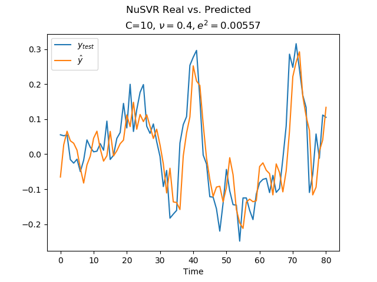

# ECE 517: Machine Learning
### Homework module 5
### David Crowley
### October 11, 2019

For this assignment we were given traning and testing data sets and were instucted to create a
ridge regression machine with an optimal gamma and compare the results with a SVR and NuSVR which
were also created with optimal parameters.

## Ridge Regression
The ridge regression is similar to the least squares algorithm except an additional term is added
to the kernel matrix to achieve more stable results. This term penalizes the slope of the solution
so small changes to input **X** do not lead to large changes to the output **y**.

The kernel matrix is constucted with the following expression:

**K** = **X**T**X**

and then the dual space coefficients **&alpha;** are calculated using:

**&alpha;** = (**K**+&gamma;**I**)-1**y**

With this we can calculate the weights which are a linear sum of the input matrix **X** with:

**w**=**X&alpha;**

With calculated weights a prediction is made with:

**ypred**=**w**T**X**

## Training and Validation

For this step I used a 5 fold cross validation routine to determine the optimal parameter &gamma; for
the ridge regression. This optimal value for &gamma; was determined to be 0.052 which led to a MMSE of
0.00808 as shown in the following plot of MSE vs. Gamma for this validation step:

Using this optimal &gamma; value we then ran a prediction on the **Xtest** dataset and compared
the results against the actual truth **ytest**. This machine achieved a MSE of 0.00575 on the prediction
against the test dataset.

## Comparison with SVR

For the next step I used a grid search five-fold cross-validation algorithm to find the optimal C and
&epsilon; values for a SVR against the **Xtrain** dataset. This step found optimal values of
C=5, &epsilon;=0.01 as shown in this heatmap:

And when the optimal machine was used to predict against the **Xtest** dataset it achieved a MSE of
0.00576 which is nearly identical results from the ridge regression above.

## Comparison with NuSVR

Finally I used the same five-fold cross validation grid search against the **Xtest** datset to find optimal
values for C and &nu;. The optimal values chosen were C=10 and &nu;=0.4.

Predicting with this optimal NuSVR machine we got a MSE of 0.00557 which again is nearly identical to the
results achieved with the ridge regression and SVR machines.

